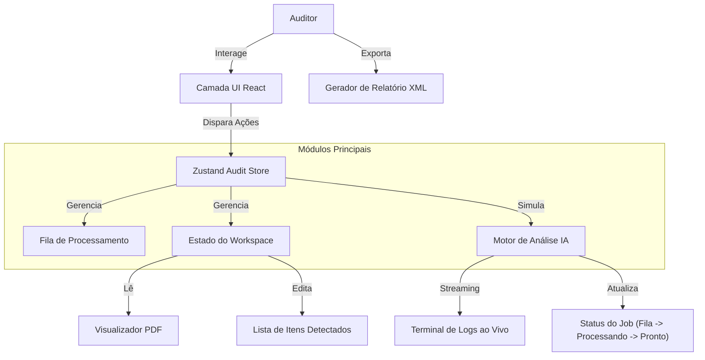

# Revena - Plataforma de Auditoria Médica com IA (Protótipo)

**Revena** é uma interface de auditoria de próxima geração projetada para automatizar e otimizar a revisão de contas médicas usando Inteligência Artificial. Este protótipo demonstra os fluxos principais de auditoria, simulação de IA em tempo real e padrões de interação do usuário.

## 🏗 Arquitetura do Sistema

Este projeto é uma **simulação Frontend-first**. Embora tenha a aparência e a sensação de um aplicativo de produção conectado a um backend robusto, a lógica de auditoria e a persistência de dados são tratadas inteiramente no lado do cliente (client-side) para fins de demonstração.

### Design de Alto Nível



## 🧩 Componentes Principais

### 1. Audit Store (`auditStore.ts`)
O "cérebro" da aplicação. Utiliza **Zustand** para gerenciar o estado global:
*   **Ciclo de Vida do Job:** Transita jobs de `na fila` para `processando` para `pronto`.
*   **Simulação de IA:** Imita atrasos de processamento do servidor e emite eventos de "log" granulares para o terminal.
*   **Itens de Auditoria:** Gerencia a lista de medicamentos, materiais e procedimentos detectados pela "IA".

### 2. Dashboard e Fila de Processamento
*   **Monitoramento em Tempo Real:** Exibe jobs ativos com badges de status ao vivo.
*   **Upload em Lote:** Simula o manuseio de upload de arquivos (`BatchUploadModal`), disparando imediatamente um novo ciclo de simulação de IA.
*   **Onboarding Automático:** Detecta a primeira visita via `localStorage` para iniciar um tour guiado (`tour.tsx`).

### 3. Workspace de Auditoria
Uma interface de painel duplo otimizada para auditoria de alta velocidade:
*   **Visualização da Fonte (Esquerda/Aba Mobile):** Exibe o prontuário médico (PDF). Neste protótipo, usamos uma estrutura de mock PDF com "Hotspots" interativos que os usuários podem clicar para verificar dados.
*   **Visualização do Editor (Direita/Aba Mobile):** Listagem de itens extraídos. Usuários podem:
    *   **Verificar Itens:** Clicar em "Enter" ou nos hotspots para marcar itens como conferidos.
    *   **Editar/Remover:** Modificar quantidades ou preços.
    *   **Atalhos de Teclado:** Controle total via teclado para power users (`↓`, `↑`, `Enter`, `Del`).

### 4. Motor de Simulação de IA
Para criar uma demonstração convincente sem backend, implementamos uma sequência de simulação:
1.  **Inicialização de Contexto:** Valida o tipo de arquivo.
2.  **Análise de Estrutura:** "Lê" as páginas do PDF.
3.  **Extração de Entidades:** Identifica itens (Medicamentos, OPMEs).
4.  **Validação de Regras:** Verifica contra regras de cobertura de seguro.
*   *Implementação:* Cadeias assíncronas de `setTimeout` que atualizam a store e enviam entradas de log.

## 🛠 Tech Stack

*   **Framework:** React 18 + Vite
*   **Linguagem:** TypeScript
*   **Estilização:** Tailwind CSS + shadcn/ui
*   **Gerenciamento de Estado:** Zustand
*   **Animações:** Framer Motion + MagicUI (TextAnimate)
*   **Persistência:** LocalStorage (Preferências do Usuário & Estado do Tour)
*   **Roteamento:** React Router DOM (v6)

## 🚀 Funcionalidades Chave

*   **Design Responsivo:** Layout totalmente adaptável. A auditoria em desktop usa tela dividida (split-screen); em mobile usa interface com abas.
*   **Modo Escuro Nativo:** Projetado com uma estética "Liquid Glass" (vidro líquido) para reduzir o cansaço visual durante longas sessões de auditoria.
*   **Exportação Real:** Geração client-side de relatórios de auditoria em XML padrão usando o estado interno dos objetos.
*   **Tours Inteligentes:** Guias de onboarding sensíveis ao contexto que iniciam automaticamente para novos usuários, mas respeitam as configurações de usuários experientes.

## 📂 Estrutura do Projeto

```bash
src/
├── components/
│   ├── dashboard/       # Fila de Jobs, Modais de Upload
│   ├── workspace/       # Interface de Auditoria, Visualizador PDF, Terminal
│   ├── ui/              # Átomos reutilizáveis (Botões, Cards, Badges)
│   └── ...
├── store/
│   └── auditStore.ts    # Lógica Central & Motor de Simulação
├── lib/                 # Utilitários (CN, formatação)
└── App.tsx              # Roteamento & Provedores Globais
```
